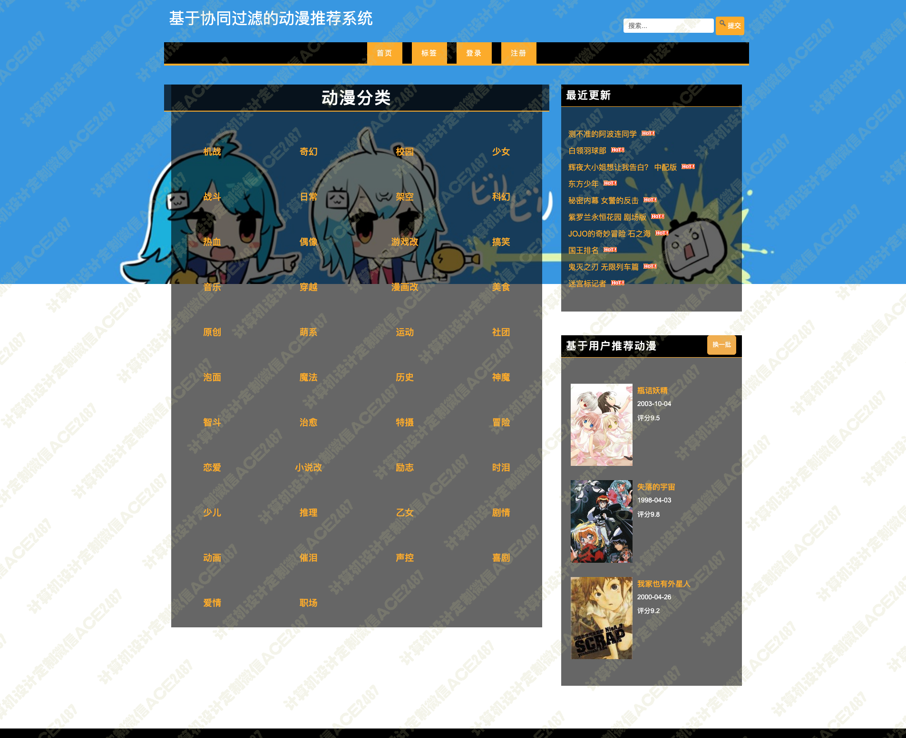
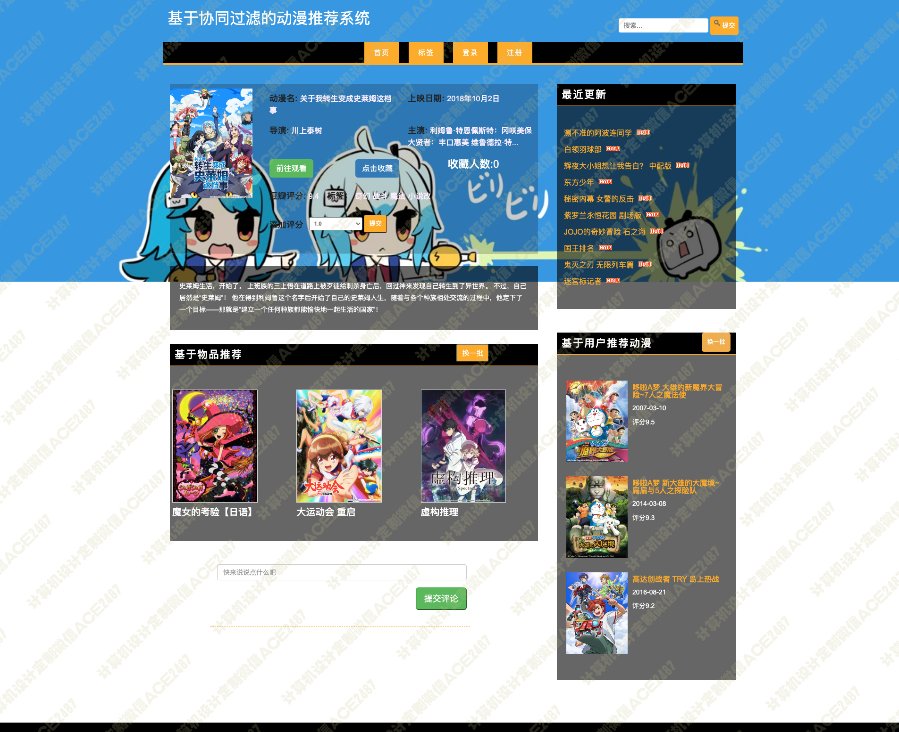
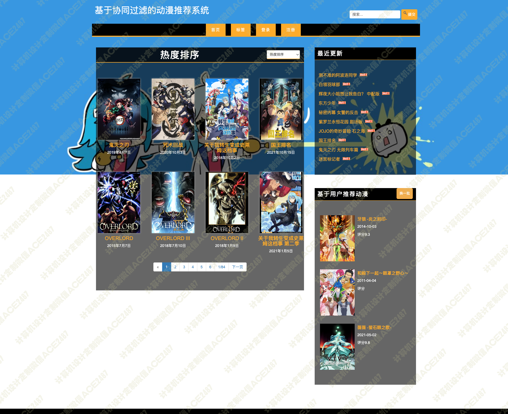

# 015 基于协同过滤的动漫推荐系统-设计源码展示

> **代码有偿获取 可接受定制 微信联系方式: csbysj2020 或 ACE2487，备注(BS)**

> 

> 

## 技术栈

python django javascript bootstrap jquery 协同过滤 推荐算法 机器学习

动漫显示、动漫分类显示、热门动漫排序显示、收藏动漫排序显示、时间排序显示、评分排序显示、算法推荐、动漫搜索、动漫信息管理

## 视频

> **点击查看 \>\>\> [https://www.bilibili.com/video/BV1934y1L7DL/](https://www.bilibili.com/video/BV1934y1L7DL/)**

## 截图

